# CHƯƠNG 3: YÊU CẦU CHỨC NĂNG (DỰ ÁN FPMS)

## 3.1. Các tác nhân

Hệ thống Quản lý và Đặt sân bóng đá trực tuyến (Football Pitch Management System - FPMS) gồm có 4 tác nhân chính:
- **Khách hàng (Customer):** Người dùng có nhu cầu tìm kiếm sân, đặt lịch đá bóng, thanh toán tiền cọc, thanh toán hóa đơn, theo dõi lịch sử đặt (bao gồm gửi yêu cầu hủy) và quản lý tài khoản cá nhân.
- **Nhân viên (Staff):** Người trực tiếp làm việc tại cơ sở sân bóng, phụ trách quản lý trọn vòng đời đơn đặt sân (duyệt đơn, tạo đơn, xử lý hủy, thanh toán cuối), cập nhật trạng thái nhận sân (ca đá) và đối soát giao dịch trong ca.
- **Chủ sân (Admin / Pitch Owner):** Người quản trị toàn bộ hoạt động của hệ thống, quản lý người dùng, danh mục sân, cấu hình khung giờ, thiết lập bảng giá thuê sân, ngày lễ, xem báo cáo thống kê doanh thu và theo dõi dòng tiền.
- **Hệ thống thanh toán (Payment Gateway):** Cổng thanh toán trực tuyến bên thứ ba (VNPAY / MoMo) hỗ trợ xử lý giao dịch thanh toán an toàn.

---

## 3.2. Xác định các ca sử dụng

| STT | Ca sử dụng | Mô tả ngắn | Tác nhân |
| :---: | :--- | :--- | :--- |
| 1 | **Đăng nhập** | Đăng nhập bằng tài khoản, google và mật khẩu để sử dụng các chức năng theo vai trò | Khách hàng, Nhân viên, Chủ sân |
| 2 | **Đăng xuất** | Thoát khỏi phiên làm việc hiện tại và bảo mật tài khoản | Khách hàng, Nhân viên, Chủ sân |
| 3 | **Đăng ký tài khoản** | Đăng ký tài khoản thành viên mới trên hệ thống | Khách hàng |
| 4 | **Quản lý hồ sơ cá nhân** | Chỉnh sửa thông tin cá nhân và đổi mật khẩu | Khách hàng, Nhân viên, Chủ sân |
| 5 | **Đặt lại mật khẩu** | Yêu cầu cấp lại mật khẩu qua mã xác thực OTP gửi về Email | Khách hàng |
| 6 | **Tra cứu thông tin sân** | Tìm kiếm sân bóng còn trống theo ngày, khung giờ và loại sân | Khách hàng |
| 7 | **Đặt sân trực tuyến** | Chọn sân, ca đá và nhập thông tin người đặt để tạo đơn giữ chỗ | Khách hàng |
| 8 | **Thanh toán tiền cọc** | Thực hiện thanh toán tiền đặt cọc (VD: 30%) ngay khi đặt sân qua hệ thống | Khách hàng, Hệ thống thanh toán |
| 9 | **Thanh toán** | Thanh toán phần tiền còn lại sau khi kết thúc ca đá | Khách hàng, Hệ thống thanh toán |
| 10 | **Quản lý đơn đặt sân cá nhân** | Xem lịch sử đơn đặt và gửi yêu cầu hủy sân | Khách hàng |
| 11 | **Quản lý đơn đặt sân** | Quản lý vòng đời đơn: Duyệt đơn, tạo đơn tại quầy, xử lý hủy và đóng ca đá (Thanh toán cuối) | Nhân viên, Chủ sân |
| 12 | **Quản lý ca đá** | Theo dõi bảng timeline lịch sân thời gian thực và cập nhật trạng thái thực tế của sử dụng khách | Nhân viên |
| 13 | **Theo dõi giao dịch** | Quản lý danh sách các phiếu thu (Transactions) để đối soát doanh thu và chốt ca | Nhân viên, Chủ sân |
| 14 | **Quản lý người dùng** | Phân quyền người dùng, khóa mở tài khoản | Chủ sân, Nhân viên |
| 15 | **Quản lý danh mục sân bóng** | Thêm mới, chỉnh sửa thông tin và cập nhật trạng thái bảo trì sân | Chủ sân |
| 16 | **Quản lý khung giờ** | Cấu hình các ca đá trong ngày và chỉ định khung giờ cao điểm (giờ vàng) | Chủ sân |
| 17 | **Quản lý bảng giá sân** | Thiết lập giá thuê sân theo loại sân, ngày thường/cuối tuần, khung giờ, thiết lập ngày lễ | Chủ sân |
| 18 | **Xem báo cáo thống kê** | Xem biểu đồ doanh thu, tần suất sử dụng sân và xuất file Excel | Chủ sân |

---

## 3.3. Biểu đồ use case

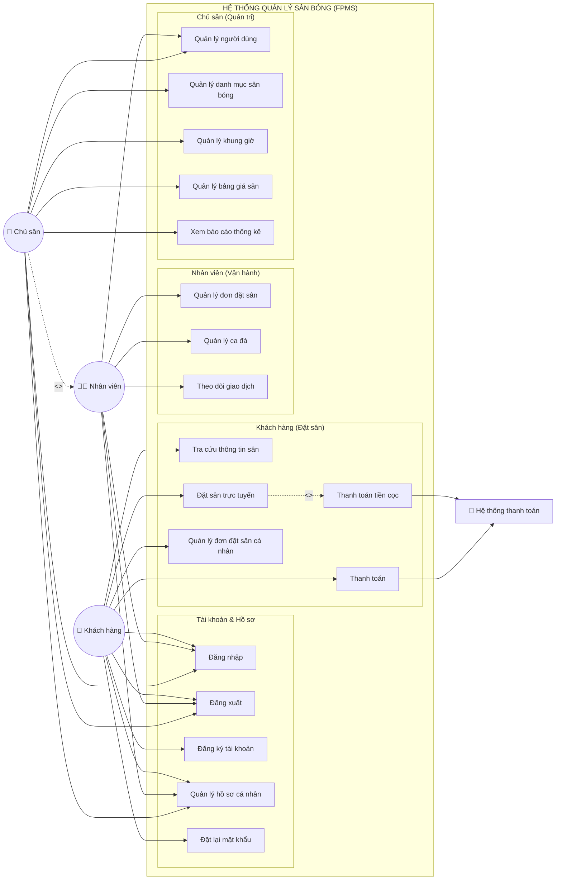

---

## 3.4. Biểu đồ hoạt động, đặc tả use case và UI

### 3.4.1. Đăng nhập

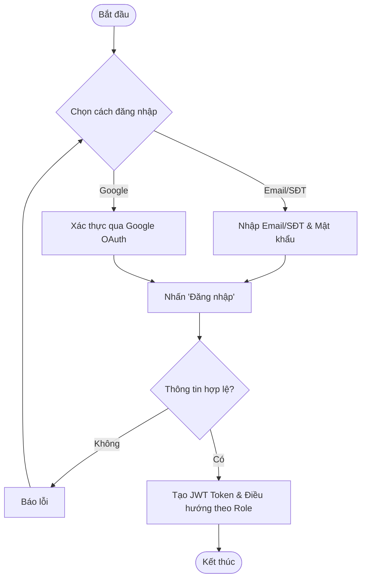

| Thuộc tính | Chi tiết |
| :--- | :--- |
| **Mã Use case** | `UC001` |
| **Sự kiện kích hoạt** | Click vào nút "Đăng nhập" |
| **Luồng chính** | 1. Khách hàng chọn hình thức đăng nhập (Email/SĐT hoặc Google). <br> 2. Hệ thống kiểm tra thông tin. <br> 3. Cấp Token và chuyển hướng theo vai trò (Khách/Nhân viên/Chủ). |
| **Luồng thay thế** | Sai thông tin: Hệ thống báo lỗi "Sai tài khoản hoặc mật khẩu". |

```text
[ ĐĂNG NHẬP ]
Email/SĐT: [ giapnh@example.com ]
Mật khẩu:  [ **********       ]
[ ĐĂNG NHẬP ]
-- Hoặc --
[ Đăng nhập bằng Google ]
```

---

### 3.4.2. Đăng xuất

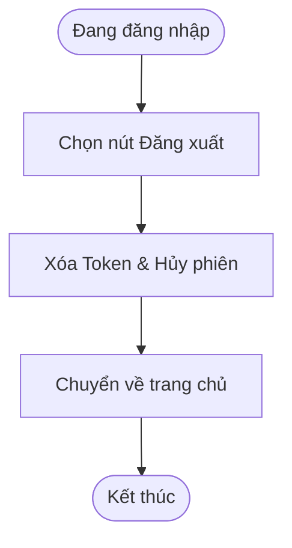

| Thuộc tính | Chi tiết |
| :--- | :--- |
| **Mã Use case** | `UC002` |
| **Luồng chính** | 1. Chọn Đăng xuất. <br> 2. Hệ thống hủy phiên và đưa về giao diện mặc định. |

---

### 3.4.3. Đăng ký tài khoản

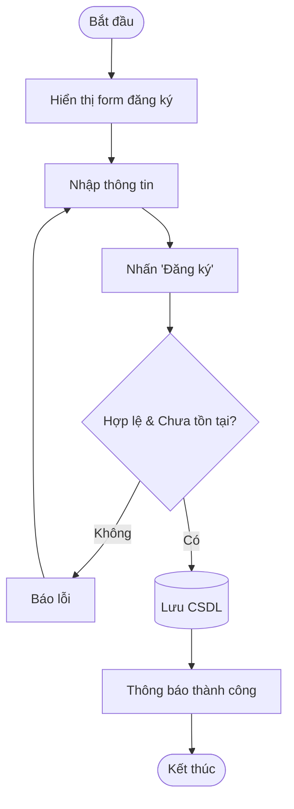

| Thuộc tính | Chi tiết |
| :--- | :--- |
| **Mã Use case** | `UC003` |
| **Luồng chính** | 1. Nhập Họ tên, SĐT, Email, Mật khẩu. <br> 2. Hệ thống kiểm tra trùng lặp. <br> 3. Lưu thông tin và báo thành công. |

---

### 3.4.4. Quản lý hồ sơ cá nhân

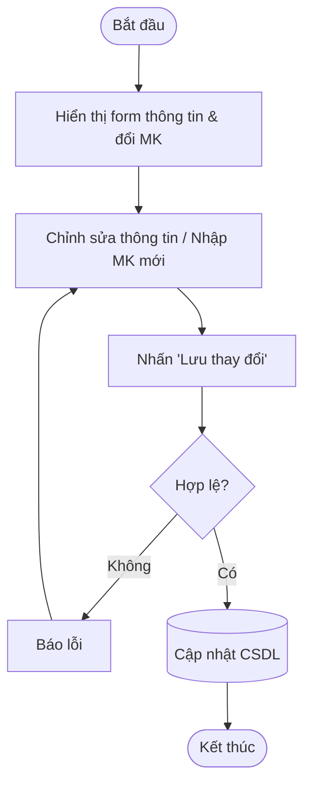

| Thuộc tính | Chi tiết |
| :--- | :--- |
| **Mã Use case** | `UC004` |
| **Luồng chính** | 1. Xem thông tin cá nhân. <br> 2. Đổi họ tên, SĐT hoặc nhập mật khẩu cũ/mới để đổi mật khẩu. <br> 3. Lưu thành công. |

---

### 3.4.5. Đặt lại mật khẩu

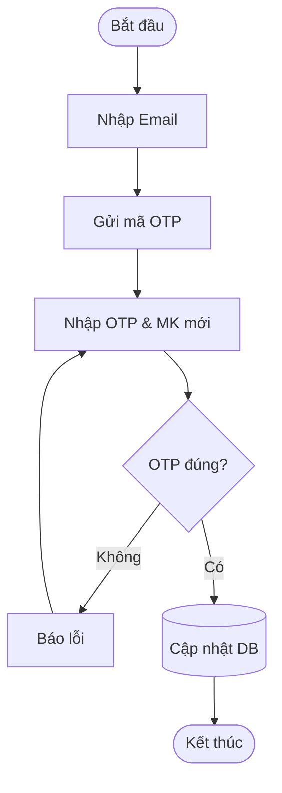

| Thuộc tính | Chi tiết |
| :--- | :--- |
| **Mã Use case** | `UC005` |
| **Luồng chính** | 1. Yêu cầu đặt lại qua Email. <br> 2. Nhập OTP và mật khẩu mới. <br> 3. Hệ thống cập nhật. |

---

### 3.4.6. Tra cứu thông tin sân

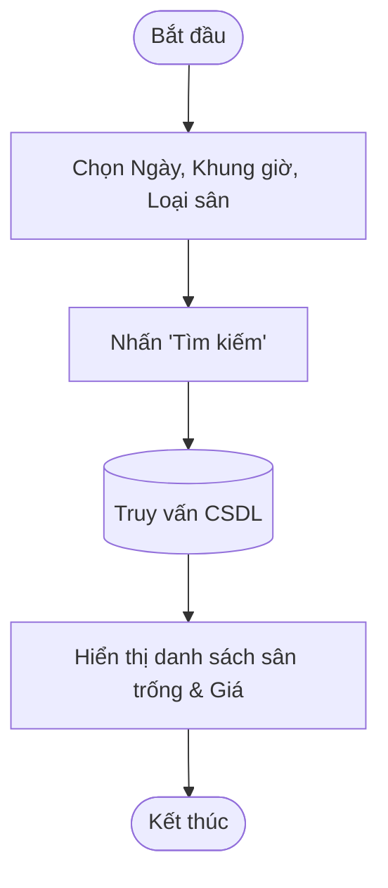

| Thuộc tính | Chi tiết |
| :--- | :--- |
| **Mã Use case** | `UC006` |
| **Luồng chính** | 1. Lọc theo ngày, giờ, loại sân. <br> 2. Hệ thống kiểm tra các đơn đã `CONFIRMED` để loại trừ. <br> 3. Hiển thị sân trống kèm giá. |

---

### 3.4.7. Đặt sân trực tuyến

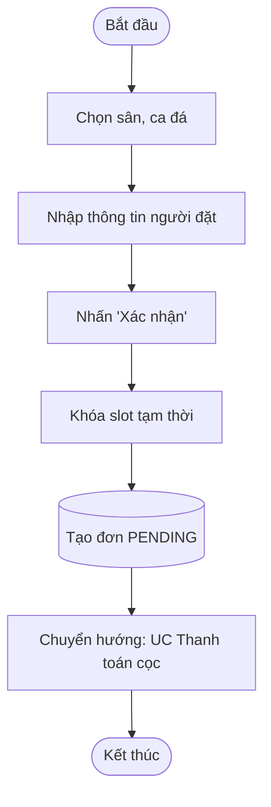

| Thuộc tính | Chi tiết |
| :--- | :--- |
| **Mã Use case** | `UC007` |
| **Luồng chính** | 1. Nhấn đặt sân. <br> 2. Xác nhận thông tin đơn đặt. <br> 3. Hệ thống tạo đơn `PENDING` và chuyển sang bước cọc. |

---

### 3.4.8. Thanh toán tiền cọc

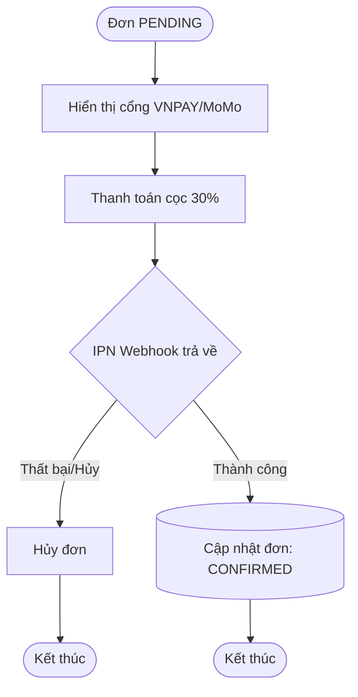

| Thuộc tính | Chi tiết |
| :--- | :--- |
| **Mã Use case** | `UC008` |
| **Luồng chính** | 1. Chọn phương thức thanh toán. <br> 2. Quét QR thanh toán cọc. <br> 3. Hệ thống nhận webhook, đổi trạng thái đơn thành `CONFIRMED`. |

---

### 3.4.9. Thanh toán

```mermaid
flowchart TD
    Start([Kết thúc ca đá]) --> CheckInvoice[Xem hoá đơn (Giá sân - Tiền cọc)]
    CheckInvoice --> ChoosePayFinal[Chọn thanh toán phần còn lại]
    ChoosePayFinal --> IPNCallbackFinal{Kết quả thanh toán}
    IPNCallbackFinal -- Thành công --> PaySuccessFinal[(Cập nhật đơn: COMPLETED)] --> EndFinal([Kết thúc])
```

| Thuộc tính | Chi tiết |
| :--- | :--- |
| **Mã Use case** | `UC009` |
| **Luồng chính** | 1. Khách kiểm tra số tiền còn lại phải trả. <br> 2. Thanh toán online. <br> 3. Hệ thống đóng ca đá. |

```text
[ THANH TOÁN HÓA ĐƠN CUỐI ]
- Tổng tiền sân:     350.000 đ
- Đã cọc:           -105.000 đ
------------------------------
- CẦN THANH TOÁN:    245.000 đ
[ TIẾN HÀNH THANH TOÁN ]
```

---

### 3.4.10. Quản lý đơn đặt sân cá nhân

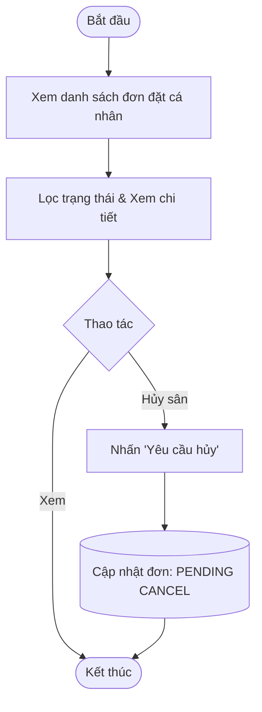

| Thuộc tính | Chi tiết |
| :--- | :--- |
| **Mã Use case** | `UC010` |
| **Luồng chính** | 1. Khách hàng vào mục lịch sử. <br> 2. Hệ thống hiển thị lịch sử các đơn đặt theo trạng thái (Đã cọc, Hoàn thành, Chờ hủy, Đã hủy). |
| **Luồng thay thế** | **Khách hàng yêu cầu hủy đơn:** Khách nhấn nút "Yêu cầu hủy" trong chi tiết đơn. Hệ thống chuyển trạng thái đơn sang "Chờ xác nhận hủy" (`PENDING CANCEL`). Khách hàng đợi nhân viên liên hệ và hoàn tiền thủ công. |

---

### 3.4.11. Quản lý đơn đặt sân

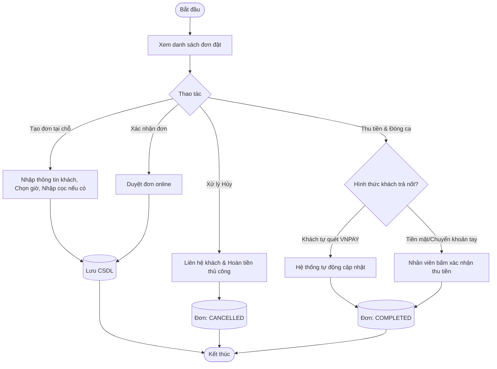

| Thuộc tính | Chi tiết |
| :--- | :--- |
| **Mã Use case** | `UC011` |
| **Luồng chính** | Ca này bao trọn vòng đời của 1 đơn đặt sân do nhân viên quản lý: <br> 1. **Tạo/Duyệt:** Tạo đơn cho khách vãng lai hoặc duyệt đơn online. <br> 2. **Xử lý hủy:** Nhân viên thấy các đơn ở trạng thái "Chờ xác nhận hủy", tiến hành liên hệ khách, hoàn tiền thủ công và bấm xác nhận hủy trên hệ thống. <br> 3. **Đóng đơn (Thanh toán cuối):** Khi khách đá xong, nhân viên thu phần tiền nợ còn lại (nếu khách trả tiền mặt/chuyển khoản tay) hoặc hệ thống tự động ghi nhận nếu khách quét VNPAY. Sau đó trạng thái đơn chuyển thành Hoàn thành. |

---

### 3.4.12. Quản lý ca đá

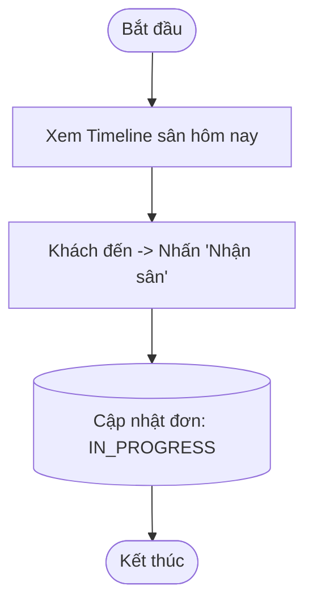

| Thuộc tính | Chi tiết |
| :--- | :--- |
| **Mã Use case** | `UC012` |
| **Luồng chính** | 1. Nhân viên mở màn hình Timeline các sân. <br> 2. Khi khách đến, nhân viên click vào ca đá và chuyển trạng thái thành "Đang đá". |

---

### 3.4.13. Theo dõi giao dịch

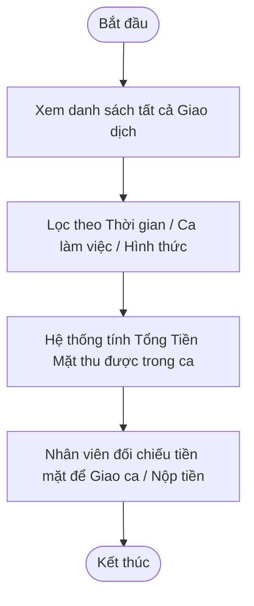

| Thuộc tính | Chi tiết |
| :--- | :--- |
| **Mã Use case** | `UC013` |
| **Luồng chính** | 1. Nhân viên/Chủ sân truy cập màn hình Giao dịch (Transactions). <br> 2. Hệ thống hiển thị tất cả các dòng tiền (Ví dụ: Tiền cọc VNPAY, Tiền mặt thu tại quầy, Tiền hoàn hủy sân). <br> 3. Nhân viên dùng tính năng này để chốt ca làm việc (Lọc riêng tiền mặt thu được để bàn giao lại két). Chủ sân dùng để đối soát doanh thu ngân hàng. |

---

### 3.4.14. Quản lý người dùng

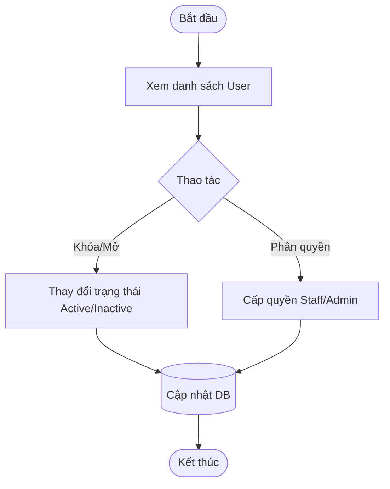

| Thuộc tính | Chi tiết |
| :--- | :--- |
| **Mã Use case** | `UC014` |
| **Luồng chính** | 1. Admin/Staff vào mục User. <br> 2. Admin có thể nâng quyền khách lên Staff, hoặc khóa tài khoản vi phạm chính sách. |

---

### 3.4.15. Quản lý danh mục sân bóng

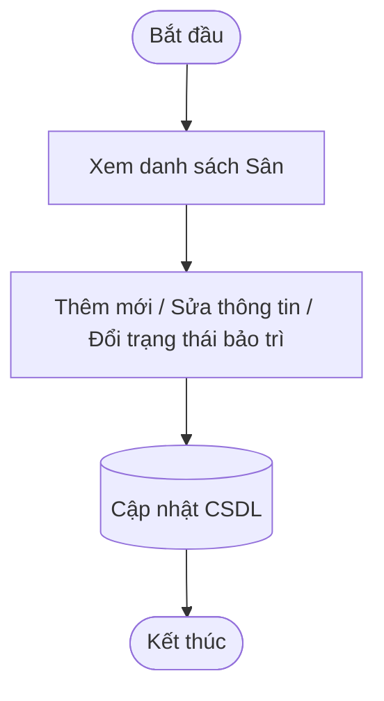

| Thuộc tính | Chi tiết |
| :--- | :--- |
| **Mã Use case** | `UC015` |
| **Luồng chính** | 1. Thêm sân mới (Tên, Loại 5/7, Ảnh). <br> 2. Sửa thông tin hoặc đánh dấu "Bảo trì" để hệ thống chặn đặt lịch. |

---

### 3.4.16. Quản lý khung giờ

```mermaid
flowchart TD
    Start([Bắt đầu]) --> ViewSlots[Xem danh sách Ca đá cố định]
    ViewSlots --> EditSlot[Thêm ca / Đổi khung giờ (VD: 17:30 - 19:00)]
    EditSlot --> SetPeak[Đánh dấu: Giờ thường / Giờ cao điểm]
    SetPeak --> SaveSlot[(Lưu DB)] --> End([Kết thúc])
```

| Thuộc tính | Chi tiết |
| :--- | :--- |
| **Mã Use case** | `UC016` |
| **Luồng chính** | 1. Định nghĩa các time slots chuẩn. <br> 2. Phân loại là Giờ vàng (PEAK) hoặc Giờ thường (NORMAL) để áp giá tự động. |

---

### 3.4.17. Quản lý bảng giá sân

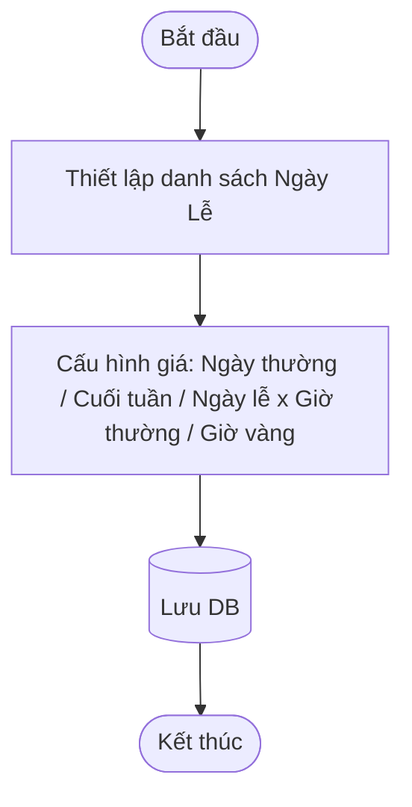

| Thuộc tính | Chi tiết |
| :--- | :--- |
| **Mã Use case** | `UC017` |
| **Luồng chính** | 1. Admin nhập các ngày lễ trong năm (VD: 02/09). <br> 2. Thiết lập bảng giá ma trận cho từng loại sân. <br> *Lưu ý: Hệ thống sẽ tự dùng bảng giá này để tính `price` lưu cố định vào bảng Booking khi khách đặt.* |

---

### 3.4.18. Xem báo cáo thống kê

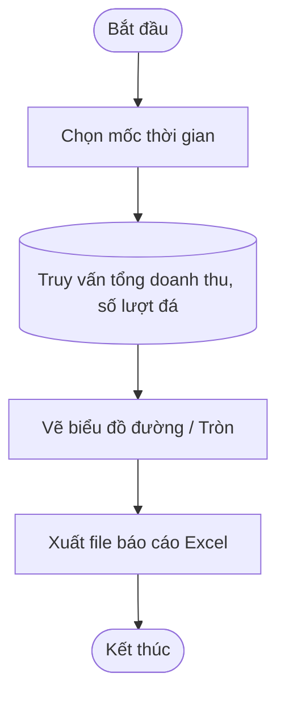

| Thuộc tính | Chi tiết |
| :--- | :--- |
| **Mã Use case** | `UC018` |
| **Luồng chính** | 1. Chọn ngày/tháng xem báo cáo. <br> 2. Xem biểu đồ trực quan. <br> 3. Tải báo cáo doanh thu về máy dưới dạng Excel. |
